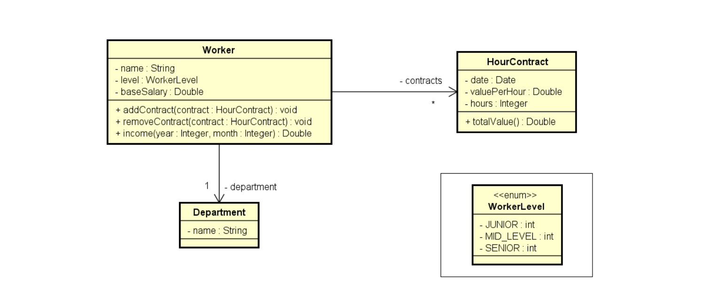

:brazil:
Praticando composição em C#. Esse programa vai pegar informações de um trabalhador, e ter 3 opções, adicionar um contrato, remover um contrato, mostrar sua renda em determindado mês e ano.

:english:
Practicing composition in C#. This program will getch the information of a worker, and gave 3 options, add a contract, remove a contract, and will show your income in a determinate month and year

